# bev_perception
papers related to bev perception

## Abstract
### 2022
* [BEVDepth](#BEVDEPTH)

* [BEVDet: High-Performance Multi-Camera 3D Object Detection in Bird-Eye-View](#BEVDET)

* [BEVDet4D: Exploit Temporal Cues in Multi-camera 3D Object Detection](#BEVDET4D)

* [BEVFormer: Learning Bird's-Eye-View Representation from Multi-Camera Images via Spatiotemporal Transformers](#BEVFORMER)

* [BEVFusion: Multi-Task Multi-Sensor Fusion with Unified Bird's-Eye View Representation](#BEVFUSION)

* [BEVerse: Unified Perception and Prediction in Birds-Eye-View for Vision-Centric Autonomous Driving](#BEVERSE)

* [CVT: Cross-view Transformers for real-time Map-view Semantic Segmentation](#CVT)

* [PETR: Position Embedding Transformation for Multi-View 3D Object Detection](#PETR)

* [PETRv2: A Unified Framework for 3D Perception from Multi-Camera Images](#PETRV2)

* [R4D: UTILIZING REFERENCE OBJECTS FOR LONGRANGE DISTANCE ESTIMATION](#R4D)

### 2021
* [DETR3D: 3D Object Detection from Multi-view Images via 3D-to-2D Queries](#DETR3D)

* [FIERY: Future Instance Prediction in Bird's-Eye View from Surround Monocular Cameras](#FIERY)  
img_backbone + LSS + temporal model + present&future distribution + future prediction + future instance segmentation and motion

* [HDMapNet: An Online HD Map Construction and Evaluation Framework](#HDMAPNET)

### 2020
* [Lift, Splat, Shoot: Encoding Images from Arbitrary Camera Rigs by Implicitly Unprojecting to 3D](#LSS)

* [Learning Lane Graph Representations for Motion Forecasting](#LANEGCN)

## Details

### 2022
#### CVPR
* CVT: Cross-view Transformers for real-time Map-view Semantic Segmentation<spain id = "CVT">
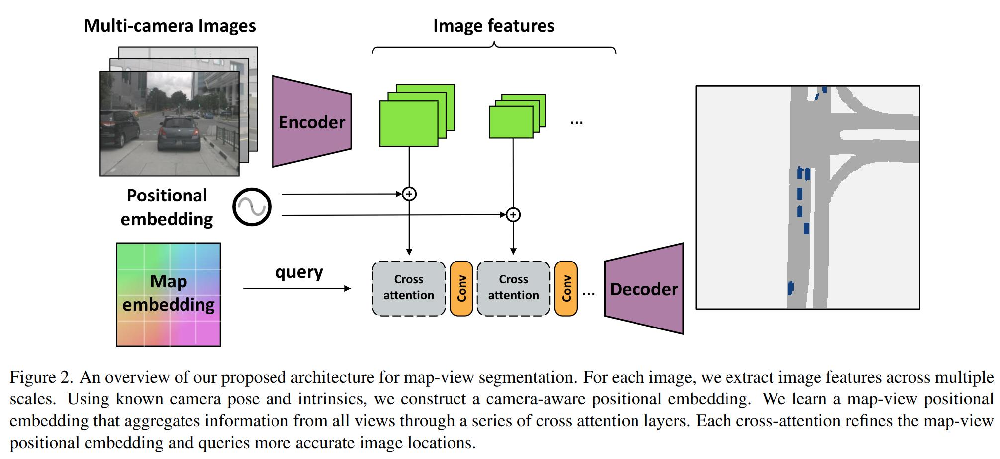

#### ECCV
* [Nanjing University] BEVFormer: Learning Bird's-Eye-View Representation from Multi-Camera Images via Spatiotemporal Transformers<spain id = "BEVFORMER">
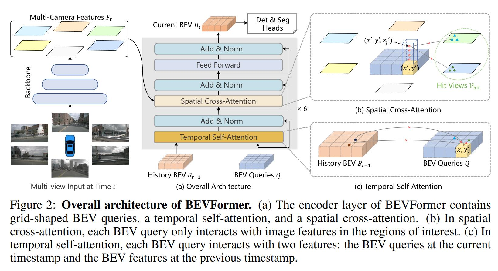

* [MEGVII Technology] PETR: Position Embedding Transformation for Multi-View 3D Object Detection<spain id = "PETR">
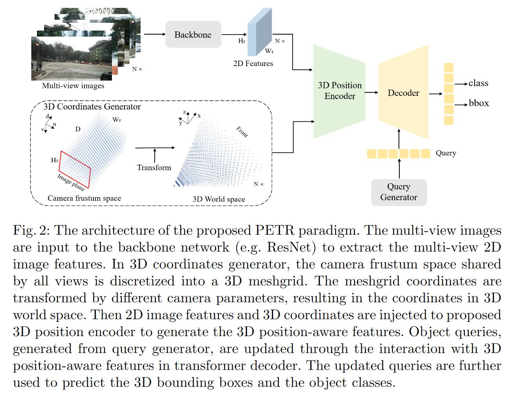

#### Arxiv
* [PhiGent Robotics] BEVDet: High-Performance Multi-Camera 3D Object Detection in Bird-Eye-View<spain id = "BEVDET">
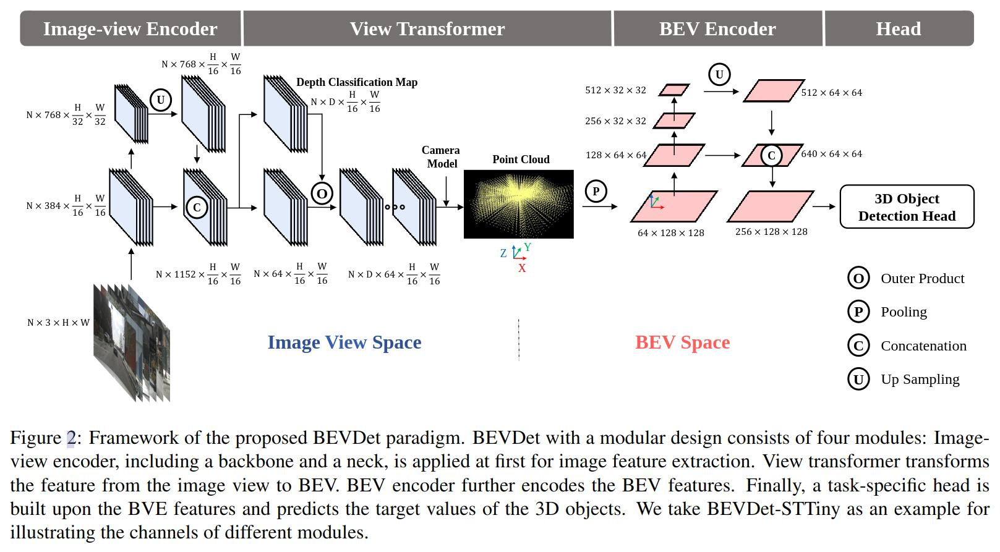

* [PhiGent Robotics] BEVDet4D: Exploit Temporal Cues in Multi-camera 3D Object Detection<spain id = "BEVDET4D">

* BEVDepth<spain id = "BEVDEPTH">
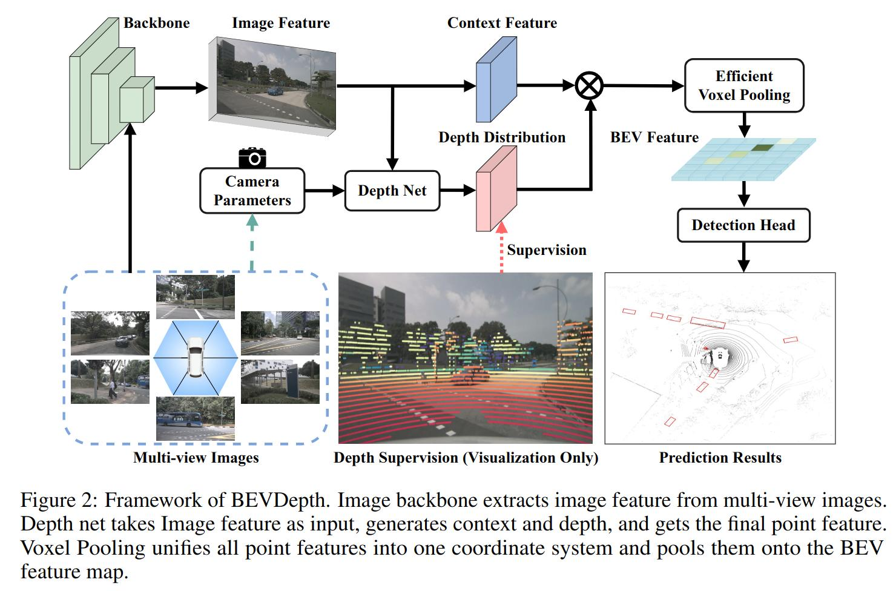

* BEVFusion: Multi-Task Multi-Sensor Fusion with Unified Bird's-Eye View Representation
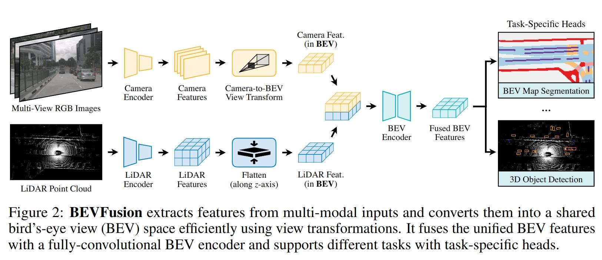

* BEVerse: Unified Perception and Prediction in Birds-Eye-View for Vision-Centric Autonomous Driving<spain id = "BEVERSE">
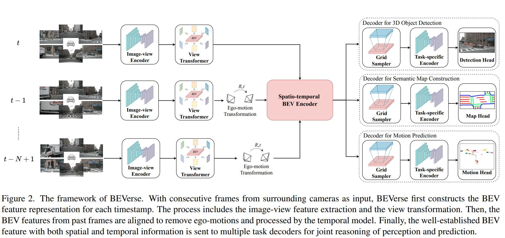

* [MEGVII Technology] PETRv2: A Unified Framework for 3D Perception from Multi-Camera Images<spain id = "PETRV2">

* [waymo] R4D: UTILIZING REFERENCE OBJECTS FOR LONGRANGE DISTANCE ESTIMATION<spain id = "R4D">
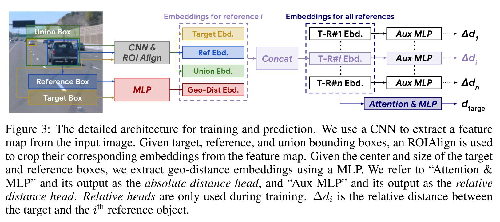

### 2021
### CVPR
* [Tsinghua University] HDMapNet: An Online HD Map Construction and Evaluation Framework
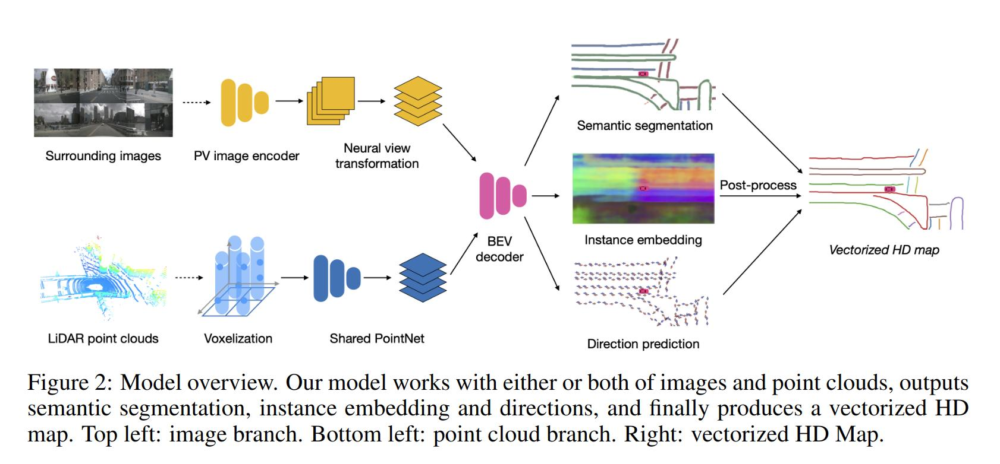

#### CORL
* [MIT] DETR3D: 3D Object Detection from Multi-view Images via 3D-to-2D Queries<spain id = "DETR3D">
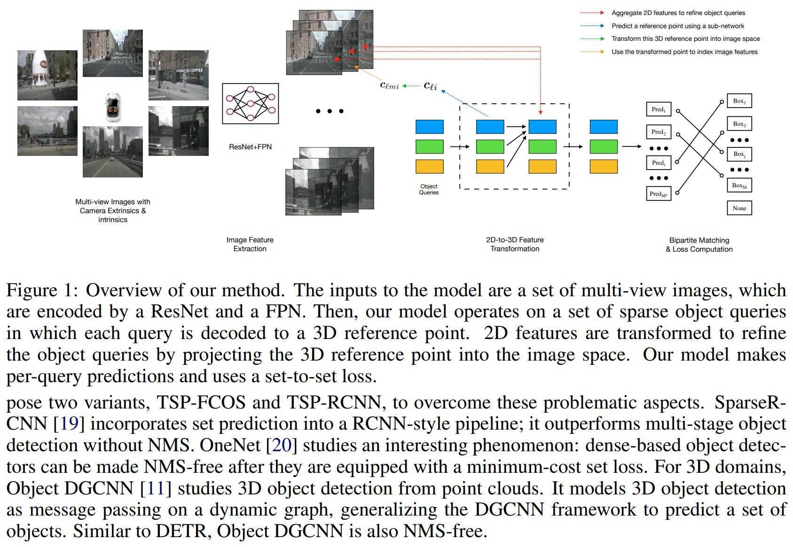

#### ICCV
* FIERY: Future Instance Prediction in Bird's-Eye View from Surround Monocular Cameras<spain id = "FIERY"> 
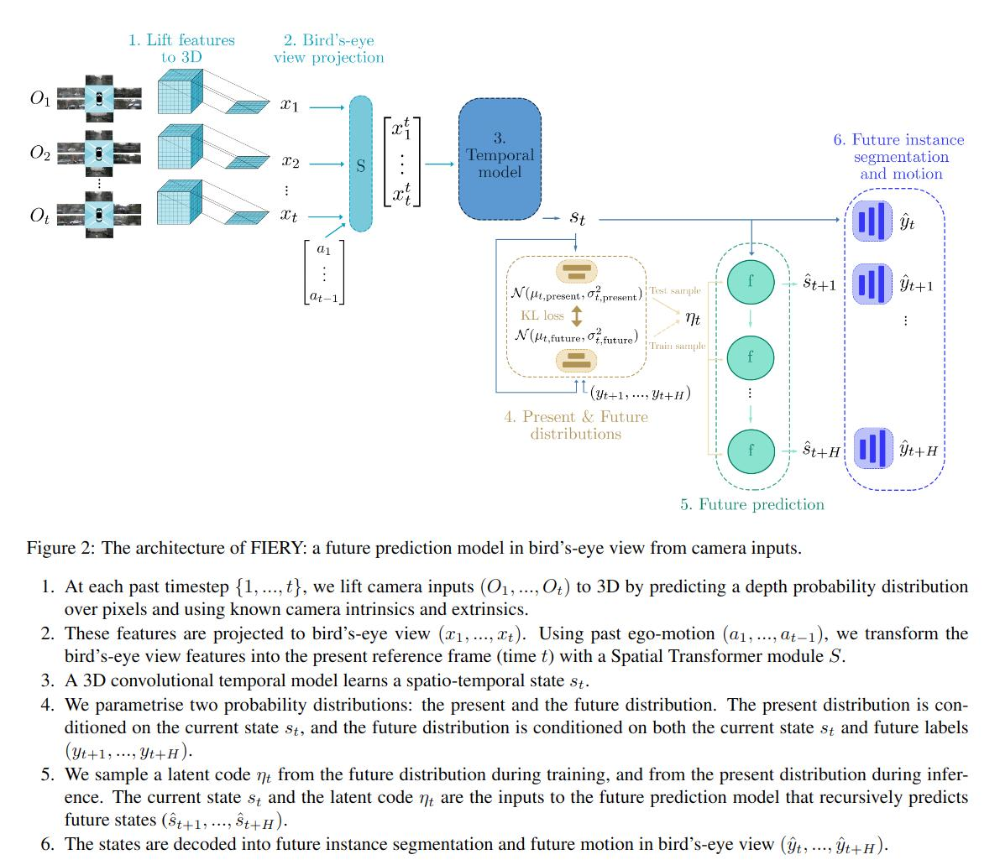

### 2020
#### ECCV
* [NVIDIA] Lift, Splat, Shoot: Encoding Images from Arbitrary Camera Rigs by Implicitly Unprojecting to 3D<spain id = "LSS">
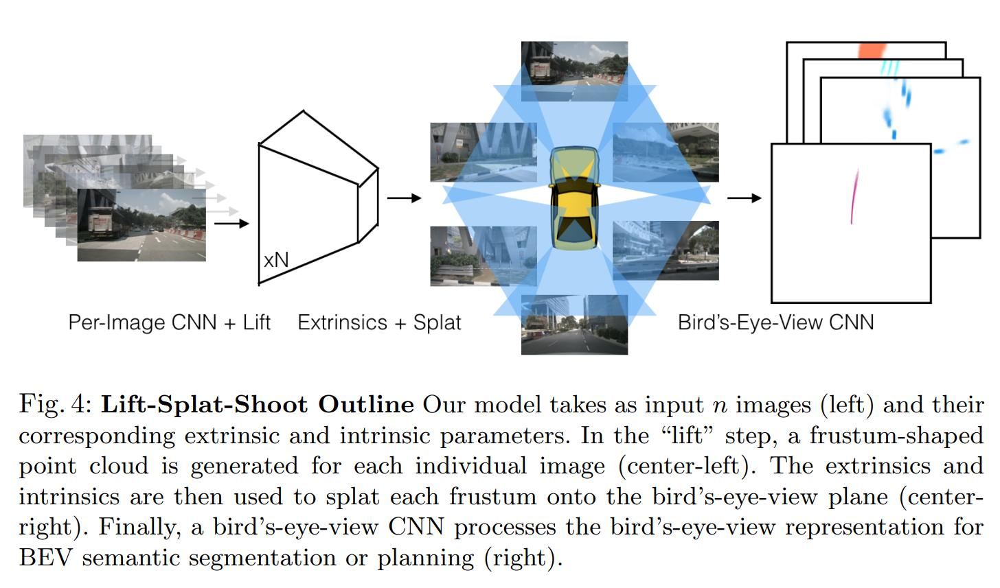

* [Uber ATG] Learning Lane Graph Representations for Motion Forecasting  
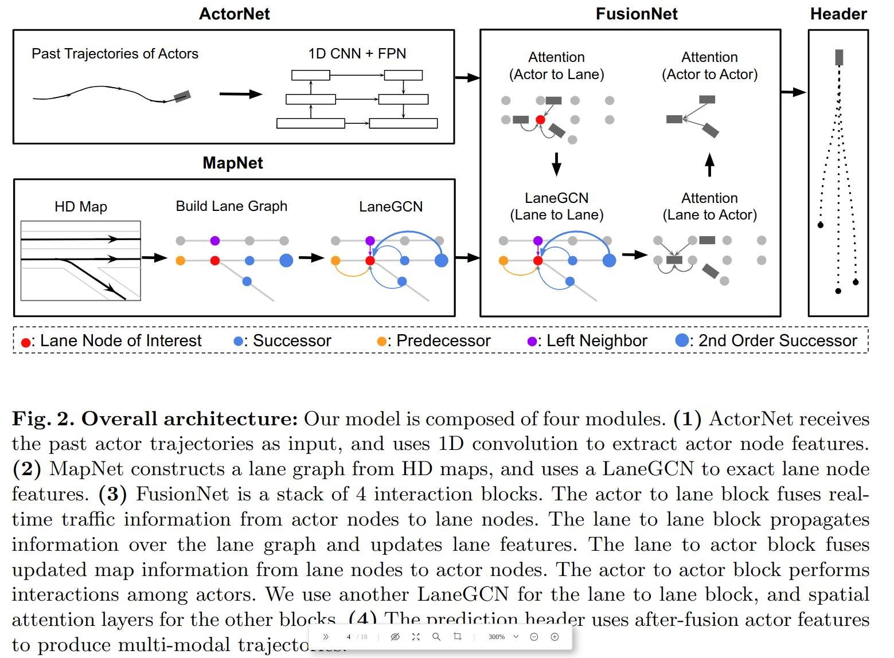