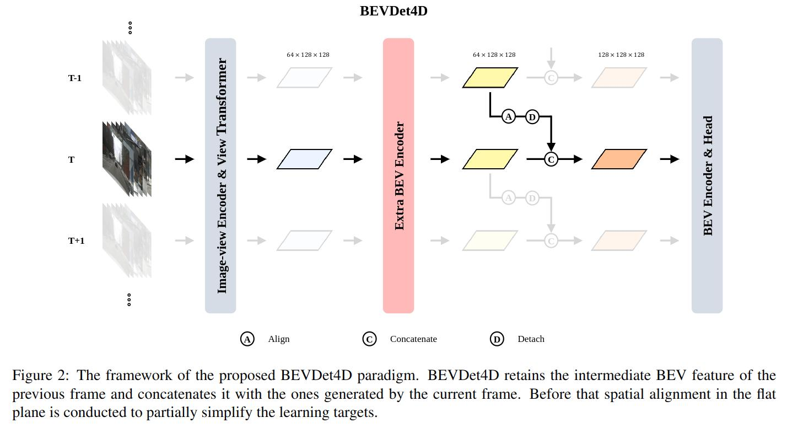

# bev_perception

papers related to bev perception

## Abstract
### 2022
* [BEVDepth](#BEVDEPTH)

* [BEVDet: High-Performance Multi-Camera 3D Object Detection in Bird-Eye-View](#BEVDET)

* [BEVDet4D: Exploit Temporal Cues in Multi-camera 3D Object Detection](#BEVDET4D)

* [BEVFormer: Learning Bird's-Eye-View Representation from Multi-Camera Images via Spatiotemporal Transformers](#BEVFORMER)

* [BEVFusion: Multi-Task Multi-Sensor Fusion with Unified Bird's-Eye View Representation](#BEVFUSION)

* [BEVerse: Unified Perception and Prediction in Birds-Eye-View for Vision-Centric Autonomous Driving](#BEVERSE)

* [CVT: Cross-view Transformers for real-time Map-view Semantic Segmentation](#CVT)

* [PETR: Position Embedding Transformation for Multi-View 3D Object Detection](#PETR)

* [PETRv2: A Unified Framework for 3D Perception from Multi-Camera Images](#PETRV2)

* [R4D: UTILIZING REFERENCE OBJECTS FOR LONGRANGE DISTANCE ESTIMATION](#R4D)

### 2021
* [DETR3D: 3D Object Detection from Multi-view Images via 3D-to-2D Queries](#DETR3D)

* [FIERY: Future Instance Prediction in Bird's-Eye View from Surround Monocular Cameras](#FIERY)  
img_backbone + LSS + temporal model + present&future distribution + future prediction + future instance segmentation and motion

* [HDMapNet: An Online HD Map Construction and Evaluation Framework](#HDMAPNET)

### 2020
* [Lift, Splat, Shoot: Encoding Images from Arbitrary Camera Rigs by Implicitly Unprojecting to 3D](#LSS)

* [Learning Lane Graph Representations for Motion Forecasting](#LANEGCN)

* [VectorNet: Encoding HD Maps and Agent Dynamics from Vectorized Representation](#VECTORNET)

## Details

### 2022
#### CVPR
* CVT: Cross-view Transformers for real-time Map-view Semantic Segmentation<spain id = "CVT">

#### ECCV
* [Nanjing University] BEVFormer: Learning Bird's-Eye-View Representation from Multi-Camera Images via Spatiotemporal Transformers<spain id = "BEVFORMER">

* [MEGVII Technology] PETR: Position Embedding Transformation for Multi-View 3D Object Detection<spain id = "PETR">

#### ICLR
* [waymo] R4D: UTILIZING REFERENCE OBJECTS FOR LONGRANGE DISTANCE ESTIMATION<spain id = "R4D">

#### Arxiv
* [PhiGent Robotics] BEVDet: High-Performance Multi-Camera 3D Object Detection in Bird-Eye-View<spain id = "BEVDET">

  * BEVDet显式的编码BEV特征，具有可扩展性较强的范式设计，作为Baseline进行模块的升级改造很方便
  * 文章贡献
    * BEVDet指出LSS生成的特征用3D目标检测在BEV空间的学习过拟合比较严重，加BEV的AUG可以使得这范式在大规模数据集下multiview 3D 目标检测达到sota
    * 首次提出LSS的ViewTransformer加速方案
    * BEV的目标分布和Image-View有本质区别，提出Scale-NMS

  

* [PhiGent Robotics] BEVDet4D: Exploit Temporal Cues in Multi-camera 3D Object Detection<spain id = "BEVDET4D">

  * BEVDet4D 在BEVDet基础上添加了少量的改动，以最大限度地保持原有范式的优雅性，主要的目的是完成两帧BEV特征的融合。具体而言就是把前一帧的BEV特征根据自车的运动信息进行特征在世界坐标系中的对齐，融合时使用的是最简单的特征Concat。这里是把真正的[特征融合](https://www.zhihu.com/search?q=特征融合&search_source=Entity&hybrid_search_source=Entity&hybrid_search_extra={"sourceType"%3A"answer"%2C"sourceId"%3A2420121870})推理过程留给BEV Encoder来完成。

  

* [MEGVII Technology] BEVDepth<spain id = "BEVDEPTH">

  * 本文认为许多最新的工作虽然加入了深度估计，但这种深度估计得到的信息是在没有相机信息的情况下隐式学习的，这使得它实际上是伪点云的伪深度。BEVDepth通过编码相机的内外参得到了显式的深度估计。

    结合代码来看，本文在基于LSS的投影部分之上加入LiDAR提供的点云数据作为ground truth，监督通过编码内外参得到的深度，以此矫正像素的深度分布估计。这种方法让模型能学习到更接近实际情况的深度预测，因此实现了大幅度的精度提升。

    在时序部分，本文先将前后帧的BEV特征图进行空间对齐，然后参考FlowNet的方法，将两帧BEV特征直接concat起来。

  

* BEVFusion: Multi-Task Multi-Sensor Fusion with Unified Bird's-Eye View Representation
  

* [Tsinghua University] BEVerse: Unified Perception and Prediction in Birds-Eye-View for Vision-Centric Autonomous Driving<spain id = "BEVERSE">

  * 文章贡献
    * 在多相机自动驾驶系统中，BEVerse是第一个并行实现BEV感知和预测任务的框架
    * BEVerse提出了迭代流的方法进行高效的未来预测和多任务学习
    * 基于这种多任务学习框架，BEVerse在nuscenes数据集的3D目标检测、语义地图重建和运动预测等任务实现了最好的表现。

  

* [MEGVII Technology] PETRv2: A Unified Framework for 3D Perception from Multi-Camera Images<spain id = "PETRV2">

### 2021
### CVPR
* [Tsinghua University] HDMapNet: An Online HD Map Construction and Evaluation Framework

#### CORL
* [MIT] DETR3D: 3D Object Detection from Multi-view Images via 3D-to-2D Queries<spain id = "DETR3D">

#### ICCV
* [Wayve] FIERY: Future Instance Prediction in Bird's-Eye View from Surround Monocular Cameras<spain id = "FIERY"> 

### 2020
#### CVPR
* [VectorNet: Encoding HD Maps and Agent Dynamics from Vectorized Representation]

#### ECCV
* [NVIDIA] Lift, Splat, Shoot: Encoding Images from Arbitrary Camera Rigs by Implicitly Unprojecting to 3D<spain id = "LSS">

* [Uber ATG] Learning Lane Graph Representations for Motion Forecasting  
